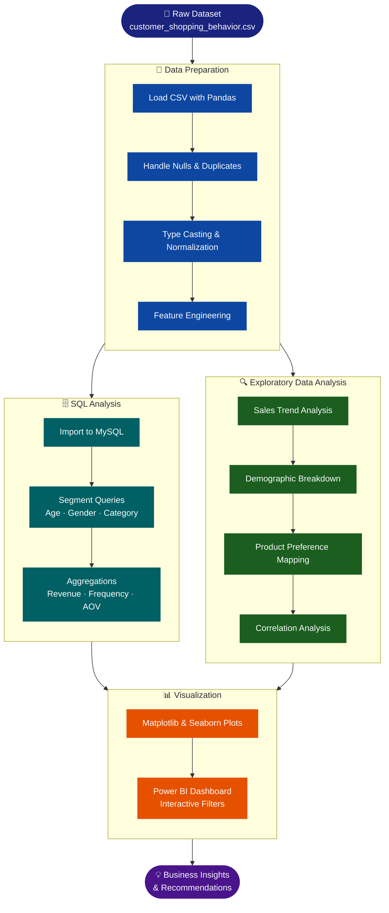
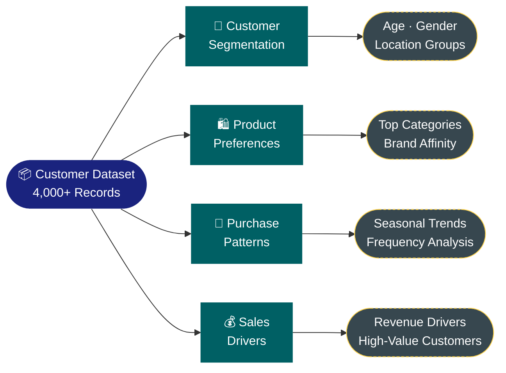
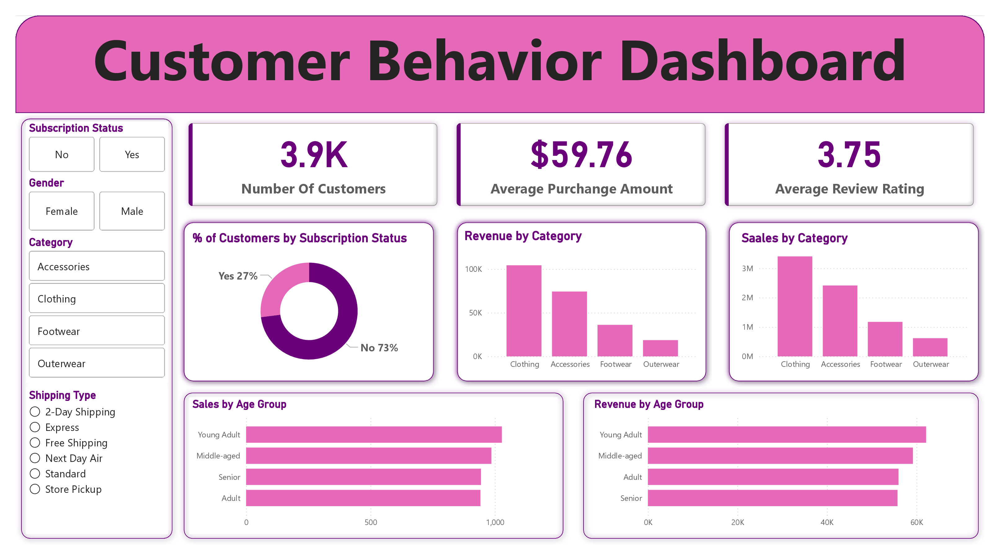

<div align="center">


[](https://git.io/typing-svg)

<br/>

[](https://python.org)
[](https://jupyter.org)
[](https://mysql.com)
[](https://powerbi.microsoft.com)
[](https://choosealicense.com/licenses/mit/)

> *Turning raw shopping data into decisions that drive business growth* 📊

</div>

---

## 📋 Table of Contents

<div align="center">

| | | |
|:---:|:---:|:---:|
| [🎯 About](#-about) | [✨ Key Features](#-key-features) | [🔄 Analysis Pipeline](#-analysis-pipeline) |
| [🛠️ Tech Stack](#%EF%B8%8F-tech-stack) | [📁 Project Structure](#-project-structure) | [📸 Dashboard Preview](#-dashboard-preview) |
| [🚀 Setup Instructions](#-setup-instructions) | [👤 Author](#-author) | |

</div>

---

## 🎯 About

This project explores **customer shopping behavior** to uncover insights about purchasing patterns, product preferences, and key sales drivers. It aims to help businesses make **data-driven decisions** to enhance:

<div align="center">

| 🎯 Area | 💡 Insight Delivered |
|:---:|:---|
| 📣 Marketing Strategy | Which customer segments respond best to promotions |
| 📦 Inventory Planning | Top-selling products and seasonal demand patterns |
| 😊 Customer Satisfaction | Behavioral trends that drive loyalty and repeat purchases |
| 💰 Revenue Optimization | Key sales drivers and high-value customer identification |

</div>

---

## ✨ Key Features

<div align="center">

| Feature | Description |
|:---:|:---|
| 🧹 **Data Cleaning** | Preprocessing with Pandas & NumPy — null handling, type casting, deduplication |
| 🔍 **EDA** | Sales trends, demographic breakdowns, and purchasing pattern analysis |
| 🗄️ **SQL Querying** | MySQL-powered customer segment deep-dives |
| 📊 **Power BI Dashboard** | Interactive visual storytelling with filters and drill-downs |
| 💡 **Business Insights** | Actionable recommendations for marketing and strategy teams |

</div>

---

## 🔄 Analysis Pipeline



---

## 📈 Insight Areas



---

## 🛠️ Tech Stack

<div align="center">

| Layer | Technology | Purpose |
|:---:|:---:|:---|
| 🐍 Language |  | Data processing & analysis |
| 📓 Notebook |  | Interactive analysis environment |
| 🗄️ Database |  | Data storage & SQL querying |
| 📊 Dashboard |  | Visual storytelling & reporting |
| 🐼 Data |   | Cleaning & transformation |
| 📉 Viz |   | EDA charts & plots |

</div>

---

## 📁 Project Structure

<details>
<summary><b>📂 Click to expand</b></summary>

```
customer_trends_data_analysis/
│
├── 📋 customer_shopping_behavior.csv     # Raw dataset (4,000+ records)
├── 📓 data_analysis.ipynb                # Jupyter Notebook — full EDA pipeline
├── 📊 customer_trends_dashboard.pbix     # Power BI interactive dashboard
└── 📖 README.md
```

</details>

---

## 📸 Dashboard Preview

<div align="center">



</div>

---

## 🚀 Setup Instructions

**1️⃣ Clone the repository**
```bash
git clone https://github.com/GeetishM/Data_Analytic_projects
cd Data_Analytic_projects
```

**2️⃣ Navigate to the project folder**
```bash
cd customer_trends_data_analysis
```

**3️⃣ Install required Python libraries**
```bash
pip install pandas numpy matplotlib seaborn mysql-connector-python
```

**4️⃣ Ensure the dataset is present**
```bash
# The file should already be in the folder:
customer_shopping_behavior.csv
```

**5️⃣ Launch Jupyter Notebook**
```bash
jupyter notebook
```

> Then open `data_analysis.ipynb` to run the full analysis pipeline.

**6️⃣ Open the Power BI Dashboard**

Open `customer_trends_dashboard.pbix` in **Power BI Desktop** to explore the interactive dashboard.

---

## 👤 Author

<div align="center">

<table>
  <tr>
    <td align="center">
      <a href="https://github.com/GeetishM">
        <br/>
        <b>Geetish Mahato</b>
      </a>
    </td>
  </tr>
</table>

[](https://linkedin.com/in/geetish-mahato)
[](https://github.com/GeetishM)

</div>

---

## 📄 License

This project is licensed under the **MIT License** — see [LICENSE](https://choosealicense.com/licenses/mit/) for details.

---

<div align="center">

⭐ If this project helped you, consider giving it a star!


</div>
