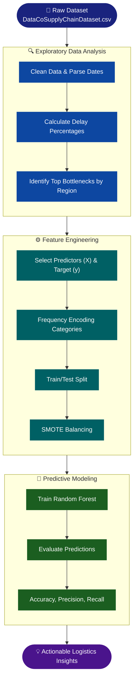

<div align="center">


[](https://python.org)
[](https://jupyter.org)
[](https://scikit-learn.org/)
[](https://choosealicense.com/licenses/mit/)

> *Transforming logistics data into predictive insights for reliable delivery.* 📦

</div>

---

## 📋 Table of Contents

<div align="center">

| | | |
|:---:|:---:|:---:|
| [🎯 About](#-about) | [✨ Key Features](#-key-features) | [🔄 Analysis Pipeline](#-analysis-pipeline) |
| [🛠️ Tech Stack](#%EF%B8%8F-tech-stack) | [📁 Project Structure](#-project-structure) | [🚀 Setup Instructions](#-setup-instructions) |

</div>

---

## 🎯 About

A global e-commerce company manages end-to-end order fulfillment across multiple regions. Recently, they have faced **inconsistent delivery performance**, leading to late deliveries and unpredictable order profitability.

**The Goal:** Analyze delivery operations to identify bottlenecks, uncover the driving factors of late shipments, and build a **predictive Machine Learning model** to assess late delivery risk before an order is even processed.

<div align="center">

| 🎯 Area | 💡 Insight Delivered |
|:---:|:---|
| 🚚 Delivery Bottlenecks | Identifying which shipping modes, regions, and products cause delays |
| ⏰ Time-Series Patterns | Uncovering delay trends by month, day of week, and hour |
| 🤖 Predictive Modeling | Random Forest Classifier to predict `Late_delivery_risk` |
| ⚖️ Class Imbalance | Using SMOTE to balance the dataset for accurate modeling |

</div>

---

## ✨ Key Features

<div align="center">

| Feature | Description |
|:---:|:---|
| 🧹 **Data Cleaning** | Handling missing values, dropping redundant features, and parsing dates |
| 🔍 **Exploratory Data Analysis** | Investigating delay rates across demographics and geography |
| 📈 **Visual Storytelling** | Professional Matplotlib/Seaborn visualizations with a custom color palette |
| 🧮 **Feature Engineering** | Frequency encoding for high-cardinality categorical variables |
| 🤖 **Machine Learning** | Random Forest model trained on SMOTE-balanced data |

</div>

---

## 🔄 Analysis Pipeline



---

## 🛠️ Tech Stack

<div align="center">

| Layer | Technology | Purpose |
|:---:|:---:|:---|
| 🐍 Language |  | Core programming |
| 📓 Notebook |  | Interactive development |
| 🐼 Data |  | Data manipulation |
| 📉 Viz |  | Statistical data visualization |
| 🤖 ML |  | Random Forest modeling |
| ⚖️ Imbalance |  | SMOTE data balancing |

</div>

---

## 📁 Project Structure

<details>
<summary><b>📂 Click to expand</b></summary>

```
supply_chain_data_analysis/
│
├── 📋 DataCoSupplyChainDataset.csv       # Raw dataset
├── 📓 Supply_Chain_Analysis.ipynb        # Full EDA & ML pipeline
├── 📁 venv/                              # Virtual Environment (Isolated dependencies)
└── 📖 README.md                          # This documentation file
```

</details>

---

## 🚀 Setup Instructions

**1️⃣ Navigate to the project folder**
```bash
cd supply_chain_data_analysis
```

**2️⃣ Activate the Virtual Environment**
*(If you haven't created one, run `python -m venv venv` first)*
```bash
# Windows
.\venv\Scripts\activate

# Mac/Linux
source venv/bin/activate
```

**3️⃣ Install required Python libraries**
```bash
pip install pandas numpy matplotlib seaborn scikit-learn imbalanced-learn jupyter
```

**4️⃣ Launch Jupyter Notebook**
```bash
jupyter notebook
```

> Open `Supply_Chain_Analysis.ipynb` to run the full pipeline and train the model.

---

<div align="center">

⭐ If this project helped you, consider giving it a star!


</div>
